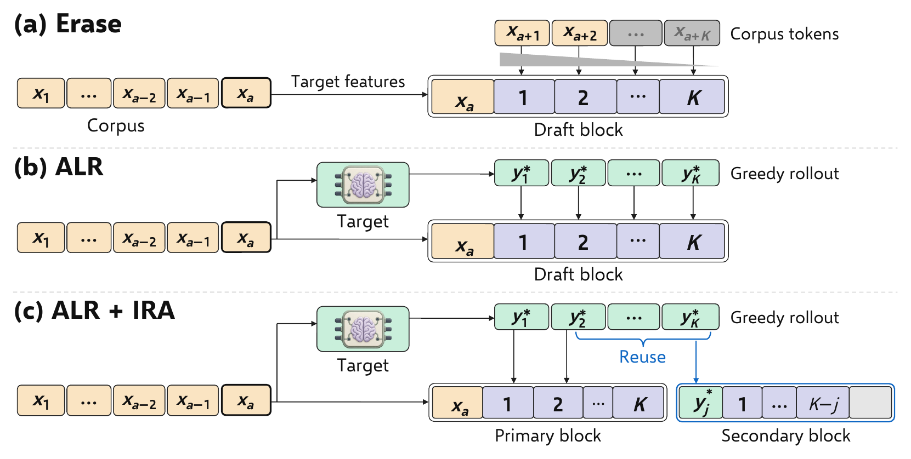
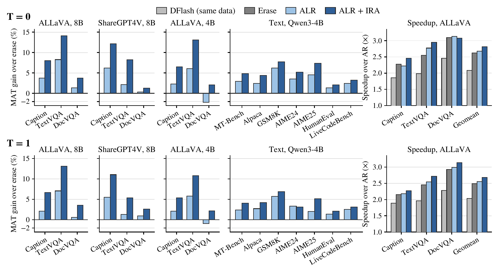

<p align="center">
  
</p>

<div align="center">

# ALR-IRA

### Target-rollout supervision for block drafters on fixed corpora

<em>Recovering Off-Policy Supervision for Speculative Decoding</em>

[](LICENSE)
[](https://creativecommons.org/licenses/by/4.0/)
[](https://www.python.org/)
[](https://github.com/js-lee-AI/ALR-IRA/stargazers)

<b><a href="#quick-start">Quick start</a> · <a href="#usage">Usage</a> · <a href="#command-line">CLI</a> · <a href="#results">Results</a> · <a href="#reproduce-the-paper">Reproduce</a> · <a href="#faq">FAQ</a> · <a href="#citation">Citation</a></b>

</div>

---

## News

- **[2026-09-28]** Code released, together with the GPU training pipeline, the prompt-level outcomes behind the paper's tables and the scripts that rebuild those tables from them on a CPU.

## Overview

Block drafters for speculative decoding are often trained on corpora written by another model. A block drafter predicts every slot of a block in parallel, and each slot is trained on the corpus token at its position, so a single corpus token that the target would not write turns every later label in the block into the continuation of a prefix the target never produces. Erasing those slots, as the survival weight of PARD-2 does, throws the supervision away, and regenerating the corpus with the target replaces the original text.

ALR + IRA recovers that supervision with short target rollouts inside the training step and leaves the corpus unchanged. It rests on three ideas.

* **Labels from the target's own rollout.** Anchor-Label Relabelling (ALR) continues the corpus prefix greedily with the target from each anchor and labels slot k with the target distribution after the first k − 1 rollout tokens, so no slot is erased (paper Eq. 3).
* **Anchors inside the rollout.** In-Rollout Anchors (IRA) keep the number of blocks fixed and move half of them into the rollouts of the other half, anchored on a token the target generated and fed with rollout features and labels that are already computed, so the target runs no extra forward pass (paper Eq. 4).
* **Longer accepted drafts from the same data.** Under greedy decoding, ALR + IRA raises the mean acceptance length τ by up to 36.5% over DFlash trained on the same data and by up to 8.54% over erase, and on ALLaVA it decodes at 2.82× over autoregressive decoding against 2.62× for erase (paper Table 1).

```
ALR   y*_i = argmax_v p_T(v | x_≤a, y*_<i)      π_a,k = p_T(· | x_≤a, y*_<k)
IRA   π(j)_a,k = π_a,j+k      ω(j)_a,k = w_k · 1[j + k ≤ K]      j ~ U{2, ..., K − 1}
```

This repository is ALR + IRA as a small numpy library, the GPU pipeline that trained and evaluated the paper's drafters, and the prompt-level outcomes with the scripts that rebuild the paper's tables on a CPU.

## What it does in one picture

<p align="center">
  
</p>

<p align="center"><em>Label construction from a fixed corpus. Erase down-weights labels conditioned on the corpus, ALR labels every slot along the target's greedy rollout, and IRA adds a secondary block inside that rollout that reuses its features and labels without another target pass (paper Figure 1).</em></p>

## Quick start

```bash
pip install "git+https://github.com/js-lee-AI/ALR-IRA.git"
```

```python
import alr_ira

# Five toy worlds, each with an order-2 target, a corpus written by another chain and
# 200 held-out prompts. Every objective trains the same 3,200 blocks per world.
results = alr_ira.run_toy(worlds=5, seed=0)
print(alr_ira.format_results(results))
# method        tau  blocks  rollouts
# DFlash       1.67    3200         0
# KD           2.12    3200         0
# Erase        3.11    3200         0
# ALR          6.82    3200      3200
# ALR + IRA    8.67    3200      1600
# slots supervised per IRA secondary block, on average: 7.05
```

This runs on a CPU in under a second and downloads nothing. The same code is [`examples/quickstart.py`](examples/quickstart.py), and CI runs it on every push.

In each toy world the target is an order-2 Markov chain, the corpus comes from a mixture of the target and a foreign chain, and the drafter is a lookup table fit in closed form to each objective's labels and slot weights. The table cannot see the token before its anchor, which comes from the corpus in training and from the target at decoding time. Tau is the mean acceptance length of greedy chain drafting on the held-out prompts. Erase beats plain distillation by dropping the off-policy slots, ALR does better by relabelling them, and ALR + IRA trains the same number of blocks from half as many rollouts while its secondary blocks supervise seven slots on average, as in paper Section 3.2. The toy is built for illustration, and its numbers are not paper results. The paper's numbers are rebuilt in [Reproduce the paper](#reproduce-the-paper).

| install | adds | enough for |
|---|---|---|
| `pip install "git+https://github.com/js-lee-AI/ALR-IRA.git"` | numpy | the core API, the quickstart and the `alr-ira` command |
| `git clone`, then `pip install -e ".[test,plot]"` | pytest, matplotlib | `experiments/`, `data/` and `tests/` |
| `git clone`, then `pip install -e ".[train]"` | PyTorch, Transformers, Accelerate, Datasets and qwen-vl-utils | training and evaluating drafters with `pipeline/` on GPUs |

Tested with Python 3.11.5 under numpy 1.26.4 and under numpy 2.4.6, which print identical output for the quickstart and every experiment script, and with the pipeline tests on a CPU under PyTorch 2.10.0 and Transformers 4.57.6. CI runs the tests on Python 3.10 and 3.13. [`pipeline/requirements.txt`](pipeline/requirements.txt) pins the versions of the GPU pipeline.

## Usage

### Label a block from the target's rollout

```python
import alr_ira

world = alr_ira.make_world(seed=0)          # a toy order-2 target and its off-policy corpus


def next_probs(tokens):                     # the target's next-token distribution
    return world.target[tokens[-2], tokens[-1]]


x = world.corpus[0].tolist()
rollout, labels = alr_ira.alr_labels(next_probs, x[:10], block_size=16)
print(rollout[:6], x[10:16], labels.shape)
# [2, 0, 19, 19, 7, 0] [22, 13, 23, 11, 6, 0] (15, 24)

p = [next_probs(x[:10 + k])[x[10 + k]] for k in range(15)]    # p_T of each corpus token
gate = alr_ira.soft_survival_gate([0] + p, [0] + [1] * 15)      # the erase weights of Eq. 2
print(round(p[0], 4), gate[1:6].round(3))
# 0.0002 [1. 0. 0. 0. 0.]
```

`next_probs` is any function that returns the target's next-token distribution after a list of tokens. The anchor here is `x[9]`, and ALR labels all 15 slots along the target's greedy rollout, shown first, while the corpus continuation, shown second, is left as it is. The target gives the first corpus token after the anchor a probability of 0.0002, so erase keeps slot 1 and weights every later slot near zero.

### Split the blocks for IRA

```python
import numpy as np
import alr_ira

mask = np.ones((2, 512))                    # loss mask of two training samples
split = alr_ira.sample_inrollout_anchors(mask, block_size=16, num_anchors=128, rng=0)
print(split["blocks"], split["rollouts"])
# 256 128
```

IRA keeps the 256 blocks that ALR would train and runs rollouts from 128 of them. The other 128 sit inside those rollouts at offsets `split["j"]` between 2 and 14, paired with the primary block in `split["parent"]`, and `alr_ira.secondary_blocks` gives their labels and slot weights.

### Train and evaluate a drafter on GPUs

```bash
git clone https://github.com/js-lee-AI/ALR-IRA.git
cd ALR-IRA
pip install -e ".[train]"

# the fixed ALLaVA training subset of the paper, from the released annotations and images
python pipeline/prepare_data.py vision --corpus allava \
    --annotations $ALLAVA_JSON --images $ALLAVA_IMAGES --output train/allava.jsonl

# three epochs of ALR + IRA with Qwen3-VL-8B on four GPUs
python pipeline/train.py --config pipeline/configs/vision_8b.json --data train/allava.jsonl \
    --method alr_ira --seed 0 --output runs/allava_alr_ira_s0

# MAT and speed against AR on COCO, TextVQA and DocVQA, at T = 0 and T = 1
python pipeline/prepare_vision_benchmarks.py --output bench/vision
python pipeline/evaluate_vision.py --draft runs/allava_alr_ira_s0/epoch_3_step_3261 \
    --data-dir bench/vision --output results/allava_alr_ira_s0.json
```

`--method` picks the objective, and every other setting comes from the config, so the arms of one comparison differ only in their objective.

| `--method` | objective |
|---|---|
| `dflash` | the DFlash cross-entropy baseline on corpus tokens |
| `kd` | distillation from the target along the corpus (KD) |
| `erase` | KD with the soft survival gate of Eq. 2, the erase comparator |
| `erase_hard` | KD with the hard gate |
| `alr` | ALR, and with `--rollout-depth 4` the short-rollout setting of Table 2 |
| `alr_gate` | ALR with the soft gate along the rollout (Table 5) |
| `alr_ira` | ALR + IRA |
| `slot_control` | the slot-matched control of Figure 4a |

`--epochs`, `--rollout-depth`, `--gamma` and `--data-order-seed` give the other schedules, rollout depths, envelopes and data orders of the appendix. `pipeline/configs/` holds `vision_8b.json`, `vision_4b.json` and `text.json`. The text target follows the same steps with `prepare_data.py text`, `prepare_benchmarks.py` and `evaluate_text.py`, and `summarize.py` turns the result files of the training replicates into the paper's aggregate.

The 100 COCO prompts come from val2017, the 100 TextVQA questions from the public train split and the 100 DocVQA questions from the validation split. `prepare_vision_benchmarks.py` loads them at pinned dataset revisions and checks every prompt against `pipeline/data/vision_manifest.json`.

### API at a glance

| call | what it does | needs |
|---|---|---|
| `alr_ira.alr_labels(next_probs, prefix, block_size)` | greedy target rollout from the anchor and the label of every slot (Eq. 3) | base install |
| `alr_ira.corpus_labels(next_probs, sequence, anchor, block_size)` | KD labels conditioned on the corpus continuation | base install |
| `alr_ira.soft_survival_gate(label_prob, scored)` | the erase weight of Eq. 2 | base install |
| `alr_ira.hard_survival_gate(corpus_tokens, greedy_tokens)` | the hard erase variant | base install |
| `alr_ira.slot_envelope(block_size, gamma)` | the slot envelope w_k of Eq. 1 | base install |
| `alr_ira.sample_anchors(loss_mask, block_size, num_anchors, rng)` | the anchor draw of KD, erase and ALR | base install |
| `alr_ira.sample_inrollout_anchors(loss_mask, block_size, num_anchors, rng)` | the IRA split into primary and secondary blocks | base install |
| `alr_ira.secondary_blocks(weight, rollout_tokens, parent, offset, keep)` | labels and slot weights of the secondary blocks (Eq. 4) | base install |
| `alr_ira.sample_slotmatched_anchors(loss_mask, block_size, num_anchors, rng, offsets)` | the slot-matched control of Figure 4a | base install |
| `alr_ira.kd_loss(draft_logits, topk_idx, topk_prob, tail_mass, weight)` | the top-8 plus tail distillation loss of Eq. 1 | base install |
| `alr_ira.mat(committed, rounds)`, `alr_ira.aggregate(per_seed)`, `alr_ira.speedup(ar_ms, draft_ms)` | the paper's MAT, its seed aggregate and speedup | base install |
| `python pipeline/train.py` | trains a drafter with one of the paper's objectives | a clone and `[train]` |

The package imports without torch. Its functions mirror the tensor code of `pipeline/`, and [`tests/test_pipeline.py`](tests/test_pipeline.py) checks that both draw the same anchors, offsets and slot weights and compute the same gates and loss.

## Command line

Installing the package adds an `alr-ira` command, and `python -m alr_ira` runs the same thing.

```bash
alr-ira --help
alr-ira demo                                  # the quickstart, on CPU
alr-ira score outcomes.csv --group domain     # tau per group, and speedup when timings are present
```

`score` reads any CSV with the columns `committed` and `rounds`, one row per prompt, and adds speedup when `ar_ms` and `draft_ms` are present ([format](data/README.md)). In a clone, it scores the first H100 timing run of ALR + IRA on ALLaVA as below, which is the T = 0 row of paper Table 17.

```
$ alr-ira score data/vision/timing.csv --where run=session1-8b-allava-alr_ira-e3-s0-t0-run1
domain           prompts     tau  speedup
caption               99   3.350    2.53x
textvqa               99   3.866    2.90x
docvqa                99   4.366    3.14x
geometric mean             3.838    2.85x
```

## Results

Across fixed vision-language and text corpora, ALR + IRA increases greedy accepted length by up to 36.5% over DFlash and outperforms erase on every evaluated domain and benchmark. A single epoch surpasses the best erase schedules, and after three epochs it matches the accepted length of training on target-regenerated responses.

<p align="center">
  
</p>

<p align="center"><em>MAT gain over erase across the vision-language and text benchmarks, and the ALLaVA decoding speedup over autoregressive decoding, after three training epochs. The top row is T = 0 and the bottom row T = 1 (paper Figure 2).</em></p>

### Speedup and accepted length after three epochs (paper Table 1)

Qwen3-VL targets with DFlash drafters trained for three epochs on one fixed corpus each. τ is the geometric mean over COCO captioning, TextVQA and DocVQA within a training replicate, averaged over replicates, and measured on an RTX A6000 for the 8B target and on an H100 for the 4B target. Speedups over autoregressive decoding are measured on H100 GPUs. Higher is better.

| method | ALLaVA, 8B speedup | τ | ShareGPT4V, 8B speedup | τ | ALLaVA, 4B speedup | τ |
|---|---|---|---|---|---|---|
| *T = 0* | | | | | | |
| DFlash | 2.09× | 2.88 | 2.01× | 2.80 | 2.19× | 2.92 |
| Erase | 2.62× | 3.54 | 2.62× | 3.57 | 2.62× | 3.56 |
| ALR | 2.68× | 3.70 | 2.80× | 3.67 | 2.65× | 3.63 |
| ALR + IRA | 2.82× | 3.84 | 2.77× | 3.83 | 2.77× | 3.81 |
| *T = 1* | | | | | | |
| DFlash | 2.04× | 2.79 | 1.90× | 2.71 | 2.04× | 2.78 |
| Erase | 2.49× | 3.39 | 2.54× | 3.39 | 2.45× | 3.33 |
| ALR | 2.55× | 3.50 | 2.54× | 3.48 | 2.53× | 3.41 |
| ALR + IRA | 2.68× | 3.65 | 2.58× | 3.60 | 2.67× | 3.53 |

The text-only target Qwen3-4B is trained on a fixed UltraChat subset and evaluated on MT-Bench, Alpaca, GSM8K, AIME24, AIME25, HumanEval and LiveCodeBench on one H100. The rows below are the geometric means over the seven benchmarks.

| method | T = 0 speedup | τ | T = 1 speedup | τ |
|---|---|---|---|---|
| DFlash | 2.35× | 3.32 | 2.23× | 3.10 |
| Erase | 2.67× | 3.75 | 2.45× | 3.46 |
| ALR | 2.70× | 3.87 | 2.48× | 3.56 |
| ALR + IRA | 2.80× | 3.93 | 2.55× | 3.60 |

Under repeated A100 timing on 220 fixed text prompts, ALR + IRA is 4.62% faster than erase at T = 0 and 3.89% faster at T = 1, with paired-prompt 95% bootstrap intervals of 3.80 to 5.42 and 2.52 to 5.28 (paper Table 11). Reproduce the whole of Table 1, including its seven text benchmarks, with `python experiments/table1_main.py`.

### One epoch against the best erase schedule (paper Table 2)

C is the best erase schedule measured on each corpus, time is training time relative to C, and τ is the mean ± SD over training replicates at T = 0. ALR uses R = 4 and ALR + IRA uses R = 14.

| corpus | method | epochs | time / C | τ |
|---|---|---|---|---|
| ALLaVA | Erase | 1 | 0.33 | 3.533 ± 0.006 |
| ALLaVA | ALR | 1 | 0.42 | 3.649 ± 0.014 |
| ALLaVA | ALR + IRA | 1 | 0.59 | 3.728 ± 0.005 |
| ALLaVA | Erase (C) | 3 | 1.00 | 3.539 ± 0.010 |
| ShareGPT4V | Erase (C) | 1 | 1.00 | 3.640 ± 0.002 |
| ShareGPT4V | ALR | 1 | 1.28 | 3.695 ± 0.011 |
| ShareGPT4V | ALR + IRA | 1 | 1.77 | 3.778 ± 0.003 |

A single epoch of ALR + IRA exceeds the best erase schedule on both corpora at less than twice the cost of one erase epoch, and on ALLaVA it needs 41% less training time than C. Reproduce the τ column and Figure 3 with `python experiments/table2_one_epoch.py`. The time column is measured wall-clock, so the script derives the ALLaVA ratios from the per-epoch GPU-hours of paper Appendix A and enters the ShareGPT4V ratios as the paper prints them.

### Against length-matched target regeneration (paper Table 4)

Qwen3-VL-8B drafters after three epochs on the same ALLaVA prompts at T = 0. The two regeneration references train with the same loss on responses the target regenerated, with the supervised length controlled by truncation or by a loss window. (a) is the overall MAT, and (b) is the MAT gain over ALR in % on COCO captions, by the output token offset at which a verification round starts. Bold follows the paper.

| method | (a) MAT | (b) 0–15 | 16–63 | 64–127 | 128+ |
|---|---|---|---|---|---|
| ALR | 3.696 | 0.00 | 0.00 | 0.00 | 0.00 |
| ALR + IRA | 3.841 | +1.32 | +5.60 | +5.15 | +3.57 |
| *Target regeneration* | | | | | |
| Truncated | 3.833 | +1.49 | +5.61 | +4.51 | +4.72 |
| Loss window | **3.856** | +3.60 | +7.21 | +5.12 | +5.65 |

ALR + IRA comes within 0.4% of both regeneration references in overall MAT while the corpus stays fixed, and its gain over ALR is larger after the first 16 caption tokens. Reproduce this table with `python experiments/table4_regeneration.py`.

### Label source and survival weighting (paper Table 5)

Qwen3-4B drafters after three epochs on the fixed UltraChat subset. MAT aggregates the seven text benchmarks, as mean ± SD across matched training replicates.

| label source | soft gate | T = 0 | T = 1 |
|---|---|---|---|
| Corpus (KD) | Off | 3.586 ± 0.0004 | 3.306 ± 0.005 |
| Corpus (erase) | On | 3.758 ± 0.015 | 3.483 ± 0.027 |
| Target rollout | On | 3.886 ± 0.001 | 3.583 ± 0.007 |
| Target rollout (ALR) | Off | 3.884 ± 0.008 | 3.580 ± 0.035 |

Survival weighting helps labels conditioned on the corpus but adds little to labels from the target's rollout, at either decoding temperature. Reproduce this table with `python experiments/table5_label_source.py`.

## Reproduce the paper

```bash
git clone https://github.com/js-lee-AI/ALR-IRA.git
cd ALR-IRA
pip install -e ".[test,plot]"
mkdir -p results
```

Every accepted length and speedup in the paper is a function of per-prompt counts, the tokens each prompt committed and the verification rounds it took, plus the milliseconds per token of the timing runs. [`data/`](data/README.md) ships these counts for the drafters behind the paper's tables, one row per scored prompt, and a run table that names the target, corpus, objective, epochs, seed and temperature of each run.

```
run,domain,prompt,committed,rounds
8b-allava-dflash-e3-s0-t0,caption,1,257,96
```

| paper | command | hardware | time |
|---|---|---|---|
| Table 1 | `python experiments/table1_main.py` | CPU | under 1 s |
| Table 2 and Figure 3 | `python experiments/table2_one_epoch.py` | CPU | under 1 s |
| Tables 3, 12 and 13 | `python experiments/table12_13_schedules.py` | CPU | under 1 s |
| Table 4 | `python experiments/table4_regeneration.py` | CPU | under 1 s |
| Table 5 | `python experiments/table5_label_source.py` | CPU | under 1 s |
| Table 8 | `python experiments/table8_domains.py` | CPU | under 1 s |
| Tables 9 and 10 | `python experiments/table9_10_text.py` | CPU | under 1 s |
| Table 11 | `python experiments/table11_repeated_timing.py` | CPU | under 1 s |
| Tables 14 and 15, Figure 4a, erase comparator of Appendix G | `python experiments/table14_15_controls.py` | CPU | under 1 s |
| Tables 16 and 17, repeated timing of Appendix H | `python experiments/table16_17_speed.py` | CPU | under 1 s |
| Figure 2 and the headline gains of Sections 1 and 4 | `python experiments/figure2_gains.py --plot results/figure2.png` | CPU | under 1 s |
| Appendix E, comparison thresholds and prompt resampling | `python experiments/appendix_e_resampling.py` | CPU | under 1 s |

Every script prints the rows it rebuilds, compares each value with the one the paper prints and ends with a count such as `176 of 176 printed values reproduced`. Across the twelve scripts, 955 printed values are rebuilt exactly, and `tests/test_paper.py` runs them all. The two resampling scripts, for Table 11 and Appendix E, draw 10,000 resamples from fixed generator seeds, so their intervals match the paper to the printed digit.

τ follows the paper's rule. A verification round commits the accepted draft tokens plus the one token the target adds, MAT pools committed tokens and rounds over the scored prompts of a domain or task, and the aggregate is the geometric mean over domains or tasks within a training replicate, then the mean over replicates. The first of the 100 prompts of each vision domain is a warm-up and is not scored.

### Training and evaluating on GPUs

[`pipeline/`](pipeline) is the code that trained and evaluated the paper's drafters, with the commands shown in [Usage](#train-and-evaluate-a-drafter-on-gpus). It adapts the SpecForge training loop and the DFlash draft model, adds the target rollout, the IRA split and the tree verifier for Qwen3-VL, and pins every training subset and evaluation prompt in [`pipeline/data/`](pipeline/data). Every drafter starts from the public text-only DFlash head of its target base model. The vision chain-verification reading of Table 15 and the EAGLE-3 comparison of Table 17 used evaluators that are not part of this release, and their outcomes ship in `data/`.

Training uses four H100 80 GB GPUs with FSDP and a batch of 6 per GPU. On them an epoch on the ALLaVA rows takes 0.75 GPU-hours for erase, 1.49 for ALR, 0.95 for ALR at R = 4 and 1.32 for ALR + IRA (paper Appendix A). MAT for the 8B target was measured on one RTX A6000 per evaluation and for the 4B and text targets on one H100, and each speed evaluator had an H100 of its own with its AR baseline timed in the same run.

### Not rebuilt on a CPU

The values below come from measurements that `data/` does not include, so no script rebuilds them.

- The training times of Table 2 and Figure 3, which are measured wall-clock. The ALLaVA ratios follow from the GPU-hours of Appendix A, and the ShareGPT4V ratios are entered as the paper prints them.
- Figure 4b and 4c, the gain of about 0.39 accepted tokens at first-token failures, and the fixed-text scoring, seed control and 3.83% first-bin threshold of the position profile (Appendix G). Their held-out caption logs are not included.
- The cross-device MAT shifts from −1.66% to +0.77% and the replicate standard deviations of Appendix E, which set the comparison thresholds. The Appendix E script rebuilds the thresholds from these inputs.
- The AR coefficient of variation of 3.4–5.6% in Appendix H, which uses timing runs beyond those in `data/`.
- The EAGLE-3 speedups of 1.26× and 1.23× that include the first draft construction (Appendix I).

## Repository layout

```
alr_ira/labels.py          slot envelope, survival gates, ALR labels and IRA secondary blocks
alr_ira/anchors.py         anchor draws for KD, erase, ALR, IRA and the slot-matched control
alr_ira/loss.py            the top-8 plus tail distillation loss of Eq. 1
alr_ira/metrics.py         MAT, the seed aggregate and speedup
alr_ira/toy.py             the toy Markov setting of the quickstart
alr_ira/cli.py             the alr-ira command
examples/quickstart.py     the CPU demo shown above
experiments/               one script per paper table or figure
data/                      prompt-level outcomes of the evaluated drafters
pipeline/                  GPU training and evaluation, adapted from SpecForge and DFlash
tests/                     CPU tests, including the pipeline's when torch is installed
```

## FAQ

<details>
<summary><b>Do I need a GPU?</b></summary>

Not for the library, the quickstart or any script in `experiments/`, which all run on a CPU from the files in `data/`. Training a drafter needs the target in memory next to the drafter, and the paper trained on four H100 80 GB GPUs. Evaluation runs the target and the drafter on one GPU.

</details>

<details>
<summary><b>Does ALR + IRA change the drafter or the decoder?</b></summary>

No. The drafter keeps the DFlash architecture and its inputs, the anchor token and the target features up to the anchor, and decoding uses the same tree verifier. Only the training labels, the slot weights and, for IRA's secondary blocks, the anchor position and its rollout context change (paper Section 3). Speculative decoding still preserves the target distribution in exact arithmetic.

</details>

<details>
<summary><b>What does the rollout cost?</b></summary>

The rollout runs inside the training step and reuses the key-value cache of the target's forward pass over the corpus sample, taking R greedy steps for all anchors of a sample at once. IRA starts rollouts from only half of the blocks and takes the features and labels of the other half from them. An epoch on ALLaVA takes 1.32 GPU-hours for ALR + IRA against 1.49 for ALR and 0.75 for erase, and one epoch of ALR + IRA already exceeds the best erase schedule (paper Table 2 and Appendix A).

</details>

<details>
<summary><b>Which models and data does it support?</b></summary>

The paper trains DFlash drafters for Qwen3-VL-8B-Instruct and Qwen3-VL-4B-Instruct on ALLaVA and ShareGPT4V and for Qwen3-4B on UltraChat, each starting from the public DFlash head of its base model, and `pipeline/configs/` holds these three settings. The functions in `alr_ira` take any next-token distribution and any loss mask, so they carry over to other targets. The pipeline reads target features through the DFlash draft model, so another target needs a DFlash head of its own and a config.

</details>

<details>
<summary><b>Why do my numbers differ from the paper?</b></summary>

bf16 tree verification can take a different greedy path on a different GPU model. The paper measured the 8B accepted lengths on RTX A6000 GPUs, and the same checkpoints evaluated on an A100 shift by −1.66% to +0.77% (paper Appendix E). Speed depends on the GPU and its load, which is why every speedup divides by an AR baseline timed in the same run. Training seeds change the anchor draws, and the paper reports means over two or three replicates.

</details>

<details>
<summary><b>How is this different from erasing slots or regenerating the corpus?</b></summary>

[PARD-2](https://arxiv.org/abs/2605.08632) weights each slot by the target's probability of the preceding corpus tokens, so its labels stay conditioned on the corpus and slots after a divergence lose their weight. Regenerating the corpus with the target gives target-written labels and context but replaces the original responses and needs a generation stage before training. ALR + IRA keeps the corpus and takes both the labels and the recent context from short target rollouts during training, and on ALLaVA it comes within 0.4% of length-matched regeneration (paper Table 4).

</details>

## Citation

If you use this code, please cite the paper.

```bibtex
@article{lee2026recovering,
  title   = {Recovering Off-Policy Supervision for Speculative Decoding},
  author  = {Lee, Jungseob and Park, Chanjun and Eo, Sugyeong and Moon, Hyeonseok},
  year    = {2026}
}
```

The arXiv identifier is added here once it is assigned. The Cite this repository button in the GitHub sidebar gives the same entry from [`CITATION.cff`](CITATION.cff).

## License

Code is MIT, see [LICENSE](LICENSE). The paper is CC BY 4.0. `pipeline/` adapts SpecForge and DFlash, both MIT, and keeps their license files in [`pipeline/third_party/`](pipeline/third_party).

## Acknowledgments

The training pipeline builds on [SpecForge](https://github.com/sgl-project/SpecForge), and the drafters use the block-diffusion draft model of [DFlash](https://github.com/z-lab/dflash), starting from the public [z-lab/Qwen3-8B-DFlash-b16](https://huggingface.co/z-lab/Qwen3-8B-DFlash-b16) and [z-lab/Qwen3-4B-DFlash-b16](https://huggingface.co/z-lab/Qwen3-4B-DFlash-b16) heads. The erase comparator adapts the survival weight of [PARD-2](https://arxiv.org/abs/2605.08632).
